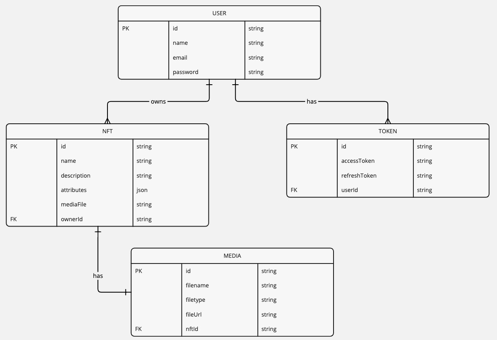

# NFT Marketplace Frontend

This is the frontend of the NFT Marketplace built with React, TypeScript, Vite, Material UI, and Redux Toolkit. It communicates with the backend API to provide functionalities such as user authentication, displaying NFTs, and uploading NFT media.

## Features

- **User Authentication**: Login, Sign Up, and session management with JWT tokens
- **NFT Gallery**: Display NFTs with pagination, and filter by categories or attributes
- **NFT Upload**: Upload new NFTs with media files (images or videos)
- **Theme Switcher**: Toggle between light and dark modes
- **Protected Routes**: Secure routes to restrict access to authenticated users only
- **Error Handling**: Global error boundaries to capture and display errors

## ER Diagram

Here is the Entity-Relationship Diagram (ERD) for the project:



## Installation

### Prerequisites

- **Node.js**: Make sure you have Node.js installed. You can download it from [here](https://nodejs.org/).

### Steps to Set Up the Project

1. Clone the repository:
```bash
git clone https://github.com/abhayrana1701/nft-project-frontend.git
cd nft-project-frontend
```

2. Install dependencies:
```bash
npm install
```

3. Set up environment variables: Create a `.env` file in the root directory and add the following variables:
```env
REACT_APP_BACKEND_URL=http://localhost:3000 # Adjust to your backend URL
```

4. Start the development server:
```bash
npm run dev
```

This will start the app at http://localhost:5173.

## Usage

### User Authentication

- **Login**: Users can log in with their email and password to get an access token and refresh token, which are used for authenticated requests.
- **Sign Up**: Users can register by providing their name, email, and password. After successful registration, they will be automatically logged in.

### Protected Routes

Certain pages (e.g., NFT Upload) are protected and can only be accessed by authenticated users. If the user is not authenticated, they will be redirected to the login page.

### Theme Toggle

The app supports light and dark themes, and users can switch between them via a button in the header.

### NFT Gallery

The app fetches and displays a gallery of NFTs from the backend API. NFTs are displayed with pagination, and each NFT contains its name, description, and media (image/video).

### NFT Upload

Authenticated users can upload their NFTs, including media (images or videos), along with metadata such as name, description, and attributes.

## API Integration

The frontend communicates with the backend API through RTK Query (part of Redux Toolkit). The main API calls are:

### User Authentication:

- `POST /users/login`: Sends login credentials and stores JWT tokens.
- `POST /users/register`: Sends user details and registers a new account.
- `POST /users/refresh`: Refreshes the access token using a refresh token.

### NFT Management:

- `GET /nfts/nfts`: Retrieves a paginated list of NFTs.
- `POST /nfts/create`: Allows authenticated users to upload new NFTs.

## Tech Stack

- **React**: Frontend library for building user interfaces
- **TypeScript**: Static typing for improved development experience
- **Vite**: Next-gen build tool for fast development and production builds
- **Material UI**: Component library for building UI with pre-built design elements
- **Redux Toolkit**: State management with Redux
- **RTK Query**: For making API requests and managing server-side data
- **React Router**: For routing between different pages
- **React Toastify**: For showing notifications (e.g., success, error)
- **MUI Icons**: For Material UI icons in the application

## Backend Setup

To set up the backend API for the frontend to communicate with, please follow the instructions in the NFT Marketplace API README for backend setup.

### Key Steps for Backend Setup:

1. Clone the backend repository.
2. Install dependencies: `npm install`.
3. Set up MongoDB and JWT secrets in the `.env` file.
4. Start the backend API: `npm start`.

Once the backend is running, ensure that the frontend can make API calls to the correct URL by updating the `REACT_APP_BACKEND_URL` environment variable.

## Conclusion

This is the frontend for the NFT Marketplace where users can register, log in, view NFTs, and upload their own NFTs. It integrates with the backend using JWT for authentication and provides a smooth user experience with Material UI components.
